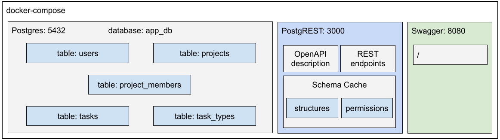

# Rapid REST API development with PostgREST database (under construction...)

This repository provides a functional template and a tutorial that allows you to build a REST API ecosystem in just 1 minute. 


*Figure 1. API overview ecosystem with Docker-compose, Postgres, PostgREST, and Swagger*

In a real-world environment, a REST API does not work in isolation. Figure 1 illustrates the basic infrastructure ecosystem of a typical API that serves information persisted by a database.
 
 * Postgres: a relational database that will perform the function of data persistence, preserving referential integrity.
 * PostgREST: Web server responsible for exposing REST endpoints and an API description according to the OpenAPI standard.
 * Swagger: service that generates an HTML documentation page from the OpenAPI description.

 ## Deploying a REST API in 1 minute
 
 Unlike many tutorials available on the internet, which will require extensive step-by-step tasks to be carried out, here the entire process is automated through Infrastructure as Code (IaC) with Docker-compose.

 Before running the codes below, ensure you already have Docker installed and started on your computer. [Click here](https://docs.docker.com/get-docker/) for instructions how to install Docker.

```shell
git clone https://github.com/luizsoliveira/jetstarter-api-postgrest

cd jetstarter-api-postgrest

docker-compose up

```

The sequence of commands above fetches the microservices/containers infrastructure shown in Figure 1. After downloading the images, the containers are initialized. During the Postgres first initialization the SQL scripts inside the folder **sql** are executed. On the sequence, the PostgREST is started and it automatically instrospect the database building cache schema. Finally, the services are available at the following URLs:

* API documentation: http://localhost:8080/
* Public REST endpoint: http://localhost:3000/countries
* OpenAPI description: http://localhost:3000/

PS.: links are available only locally and after starting the containers.

```shell
###########################################################################
# DISCLAIMER: The steps outlined below are cited for documentation and explanation purposes only.
# Therefore, it is NOT necessary to run them, since the entire process of deploying the API has
# already been carried out automatically as it is written within the Infrastructure as Code (IaC) paradigm.
###########################################################################
```

## Why use PostgREST?

Regarding systems development, a subject that always arouses my interest is reuse and automatic code generation. There is a fair amount of project code, especially at the project's beginning, that can be generated automatically using special tools.

An excellent example of applying this technique can be the rapid development of a REST API, a demand common to almost all projects. In this article, we will talk about PostgREST.

PostgREST allows you to deploy a robust REST API with the following functionalities list with minimal effort:
* CRUD basic operations
* HTTP verbs: GET, POST, PUT, PATCH, DELETE and HEAD
* OpenAPI description
* Authentication
* Horizontal filtering (selecting lines)
* Vertical filtering (selecting columns)
* 30 different operators ([link](https://postgrest.org/en/stable/references/api/tables_views.html#operators))
* More complicated filters and joins using views
* Full-Text search
* Ordering
* Limits and Pagination
* Resource embedding
* Bulk insert
* Upsert (update or insert)
* among others

## Understanding what's behind the magic


According to the official website, PostgREST is a standalone web server that turns your PostgreSQL database directly into a RESTful API. The structural constraints and permissions in the database determine the API endpoints and operations.


*Figure 2. API development workflow with PostgREST*

The strategy applied by PostgREST consists of the belief that the database has all the information about the model needed to generate the endpoints of a REST API. According to the creators, writing exclusive code for the API creates duplication of business rules or inconsistency with what was defined in the database.

With this principle in mind, PostgREST performs a robust introspection in the database, gathering all the necessary information about structures and permissions. With this information, it creates a database schema cache that is used to operationalize the API endpoints.

Figure 2 illustrates the development flow of a REST API using the PostgREST + Swagger ecosystem. According to the workflow above, the only necessary code input is the SQL commands responsible for defining the relational model.

As previously mentioned, the only source of knowledge in this approach is the database, from which all information about structures and access permissions can be obtained.

Through the introspection of the structures present in the database, such as schemas, tables, relationships, views, and functions, among others, PostgREST builds a cache that is used for the dynamic generation of structures that would be equivalent to the controllers of traditional development.

For the implementation of CRUD endpoints, the effort is minimal, just modeling the structures in the database, which would already be done anyway. With only the input of SQLs, PostgREST can already offer the CRUD endpoints of each entity, as well as the technical description of the API in OpenAPI format. Finally, from this description, Swagger renders the documentation page (Figure 3).


*Figure 3. Swagger documentation page automatically generated from the database schema*

## Exposing REST endpoints


*Figure 4. API ecosystem architecture with Docker-compose, Postgres, PostgREST, and Swagger*

Figure 4 illustrates a straightforward scenario used for teaching purposes in this article.

During the PostgREST configuration process, it is necessary to inform which database schema will be accessed. PostgREST even supports using more than one schema, but in this tutorial, we will limit ourselves to just one schema.

This schema restriction, which may initially seem like a limitation, is a fundamental principle for guaranteeing the security and integrity of the information assets persisted in the database.

The restriction that PostgREST will only access the schema(s) explicitly indicated guarantees isolation in which the API will only access the resources the database administrator has explicitly made available in the schema in question.

In this way, the Postgres database can have numerous schemas created, but only the **api** schema (in our case) will be visible by PostgREST. PostgREST will dynamically create REST endpoints for each of the accessible tables, views, and stored procedures within the indicated schema, respecting the access permissions defined in the database.

Note: A configuração do schema visível pelo PostgREST está presente no arquivo .env, que por sua vez é acessado pelo Docker-compose e repassa essa informação como variável de ambiente para o container do PostgREST. 

```bash
#Excerpt from .env file
# List with one or more schemas that will be served as REST API by PostgREST
PGRST_DB_SCHEMAS = "api"
```

## Good practices for exposing REST endpoints with PostgREST

A beneficial practice is not to directly expose the table in the schema visible by PostgREST. Keep your tables in a schema not reachable by PostgREST, and instead, put only views in the exposed schema.

The first advantage is that you can have the freedom to expose a subset of the data available in the table in the API, restricting, for example, that columns and/or rows of the table are not present in the view.

The second advantage is that you can use this indirection to manage different API versions. You can have an api-1.0 schema and another api-2.0 schema. Both schemas can coexist by creating different abstractions of the same database. This indirection provides the necessary freedom for database evolution while preserving legacy API versions.

## Exposing a public REST endpoint

PostgREST provides the functionality to expose public REST endpoints. In this context, public are the endpoints that can be accessed without authentication. This feature should be used with great caution and is only recommended for read-only access and non-sensitive data.

To activate the resource, it is necessary to define the ROLE of the database that will be used for this public access. Only resources accessible by this ANONYMOUS ROLE will be offered in the public version of the API.

```bash
#Excerpt from .env file
# DB role that will be used for public API access
PGRST_DB_ANON_ROLE = "api_anon_user"
```

In addition to indicating the ROLE, it is necessary to create the respective role in the database.

```sql
-- Creates the role api_anon_user
CREATE ROLE api_anon_user nologin;

-- Allow app_user switch to api_anon_user
GRANT api_anon_user TO app_user;

-- Allow api_anon_user to use the api schema
GRANT usage on schema api to api_anon_user;
```


